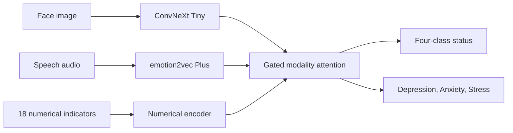

# Aegis Multimodal Mental-Health Research Prototype

## What the project does

Aegis combines facial-expression, speech-emotion, and structured behavioral/physiological signals to study mental-health status classification and depression/anxiety/stress score regression. It is a research decision-support prototype—not a diagnosis or clinical device.

## Architecture diagram



Fusion is weakly class-conditionally aligned across independent datasets, not participant-paired.

## Final results table

| Branch | Primary protocol | Accuracy | Macro F1 |
|---|---|---:|---:|
| Face | ConvNeXt-Tiny, real FER2013 test | 0.6896 | 0.6852 |
| Speech | emotion2vec+, actor-independent RAVDESS | 0.7583 | 0.7405 |
| Numerical | Original-real baseline | 0.2617 | 0.2245 |
| Fusion | Weak class-conditional research construction | 0.6633 | 0.5224 |

See [results/FINAL_RESULTS.md](results/FINAL_RESULTS.md) for authoritative metrics, secondary benchmarks, and evaluation boundaries.

## Repository structure

```text
src/{face,speech,numerical,fusion,api}/  Models, training, and API
frontend/                              React/Vite demo
configs/                               Reproducible experiment settings
scripts/                               User-facing run and audit commands
results/{face,speech,numerical,fusion}/ Evidence and visualizations
docs/                                  Dataset, model-card, and limitation notes
tests/                                 Consistency and smoke tests
models/                                Local checkpoints (gitignored)
```

## Installation

```powershell
python -m venv .venv
.\.venv\Scripts\Activate.ps1
python -m pip install -r requirements.txt
cd frontend
pnpm install
```

## Running the demo

The frontend defaults to clearly labeled demo mode and needs no checkpoint:

```powershell
cd frontend
pnpm dev
```

For the metrics API:

```powershell
python -m uvicorn src.api.main:app --host 127.0.0.1 --port 8100
```

## Training each modality

Commands assume raw datasets are supplied locally and are never committed:

```powershell
python -m src.face.train
python -m src.speech.train
python -m src.numerical.train_original
python -m src.numerical.synthetic_generator
python -m src.numerical.train_synthetic
python -m src.fusion.train_fusion
```

## Explainability

Face outputs include Grad-CAM examples; speech reports ROC/PR and per-class behavior; numerical analysis includes feature importance and leakage audits. Explanations indicate model sensitivity, not causality.

## Dataset information

- FER2013-style seven-class facial emotion data.
- RAVDESS eight-class speech emotion data with a strict actor-independent primary split.
- Structured 18-feature behavioral/physiological dataset plus a separately evaluated synthetic benchmark.

See [docs/DATASETS.md](docs/DATASETS.md).

## Limitations

Datasets are small, imbalanced, culturally narrow, and not participant-paired across modalities. Synthetic and random-split results do not establish real-world generalization. See [docs/LIMITATIONS.md](docs/LIMITATIONS.md).
